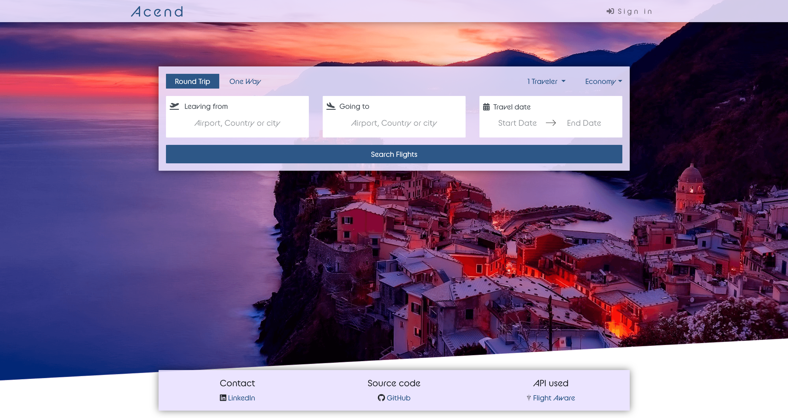

# Acend
[https://www.acend.site](www.acend.site) is a live airline web app. It communicates with an API that provides real-time worldwide flight traffic data.
This demo project was built using the MERN stack (MongoDB, Express, React, Node) and deployed using an AWS EC2 instance.
***

***
# Purpose
The purpose of this project was to use it as a vehicle for learning. I wanted to learn more about JSON Web Tokens, RESTful APIs, state management with react-redux, and deploying  a website on the cloud using an AWS EC2 instance. I wanted to experience what it was like to work on every part of the stack, from design to deployment.

# What's in the stack?
### Front end
*	Used React + Boostrap on the front-end
*	Managed state w/ React redux
*	Styled components w/ Bootstrap & managed CSS w/ SCSS
*	Managed animations w/ libraries like Tippy & Framer motion
*	Built a controlled form w/ validation using libraries like Formik & Yup
*	Ensured responsiveness and compatibility w/ mobile devices
### The Middle
*	Deployed using an AWS EC2 instance
*	configured server w/ Nginx
*	Configured the DNS & TLS w/ Cloudflare
### Back end
*	Built a custom RESTful API using the Express library w/ Node
*	Built an endpoint that supplies resources from an external API
*	Added support for sign up, log in & adding/deleting favorites
*	Used Mongo as a non-relational database, w/ the help of libraries like Mongoose
*	Implemented Google’s O Auth 2.0 token strategy with Passport.js
*	Used JSON Web Tokens and signed cookies to handle all authorization on the server endpoints

# Future improvements
* Refactor SCSS, define a nomanclature for classes
* Rearange the folder structure
* Refactor code to utilize Reactstrap instead of React + Bootstrap
* Implement the use of a refresh token for server authorization
* Implement Twitter's and Github's O Auth 2.0 token strategy
* Build a card that shows more details about a selected flight
* Optimize for accesibility
* Improve flight recomendations
* Add support for testing in development mode
