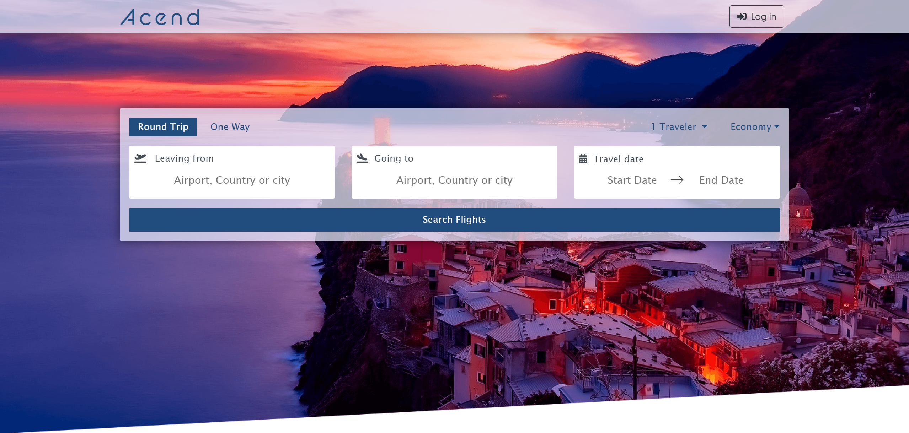

# [Acend](https://www.acend.site)

A mock airline website that consumes a proprietary API and displays the real-time list of flights scheduled at a selected airport. https://acend.site

This project was built using the MERN stack (MongoDB, Express, React, Node). The goal was to create a mobile friendly application and focus on the search-flights widget.

I was inspired by [Expedia](https://www.expedia.com/) and [Volaris](https://www.volaris.com/). They have a U.I that is minimalistic and user friendly.
The purpose of the project was to deploy a live webiste and use it as a vehicle for learning different technologies. Some of the design choices were predicated soley on their learning potential. I wanted to strengthen my knowledge with the technologies I learned at [Nucamp](https://https://www.nucamp.co/) . 

## Tech

### The Front
* Designed using Adobe XD
* Built w/ React & Bootstrap.js
* Managed state w/ Redux.js
* Managed animations w/ Popper.js and Framer Motion
* Handled CSS using SCSS and Styled-Components
* Implemented AirBnB's react-dates.js, a date picker library
* Built a recomendation search-bar
* Ensured compatability w/ mobile devices

### The Middle
* Deployed application using an AWS EC2 instance
* Configured server using Nginx
* Configured DNS and SSL/TLS with CloudFlare

### The Back
* Customized server endpoints using Node with Express
* Used Mongodb w/ mongoose as a database
* Configured a communication with FlightAware, a proprietary API that provides real-time flight tracking data
* Implemented Facebook’s and Github’s OAuth2.0 token strategy with Passport.js
* Handled user sessions with JWT tokens
* Configured backend server to allow cross-origin requests

### CI/CD
* Utilised the SCRUM methodology
* Implemented automated testing
